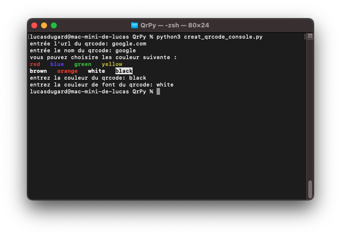

# Générateur de QR Codes en Python

## Installation

Pour utiliser QrPy, vous devez installer le module `qrcode` avec la dépendance
`pillow` pour le traitement des imageset ainsi du module `termcolor` pour la version.  
Vous pouvez le faire en exécutant les commande suivante : 

#### Pour mac/linux:

`pip3 install pillow` 
`pip3 install qrcode` 
`pip3 install termcolor`

#### Pour windows:

`pip install pillow` 
`pip install qrcode` 
`pip install termcolor`

## Présentation

QrPy vous permet de créer facilement des codes QR en Python.

Vous avez le choix entre les types de program:

### programme console

Si vous n'avez pas d'interface sur votre os vous avez le programme en console

### program graphique 

Si vous voulez avoir une belle interface il suffit de prendre la version adéquat à votre système
 
